# Design #
_decor8r_. How it hangs together, what drove the decisions, how it works. This is a work in progress, design decisions are made based on the project road map. Nothing is set in stone during the first couple of releases. Things can change drastically if compelling reasons arise.

## Architecture ##
_**decor8r**_ follows a general client-server architecture. The servers is called the _**decor8r**_ _daemon_ (_daemon_) and the client is called the _**decor8r**_ _client_ (_client_). On startup the _daemon_ reads one or more configuration files to establish the decoration rules, themes and options. The _daemon_ can be instructed to refresh its configuration on demand. The _daemon_ gets requests from _client_, builds the decoration according to the configuration rules and pass the decoration back to the client which displays the decorated prompt or status line.

The following graphic shows an example of _**decor8r**_'s most likely high-level architecture as of version 0.1.x:

The _daemon_ front end accepts requests from clients, forwards the requests to the appropriate _daemon_ back end components which produces the decorations according to configuration rules.

## Decision Backlog and Resolution Register ##
The _Decision Backlog and Resolution Register_ keeps track of decisions that still need to be made, together with a target release by which time the decision should be resolved. The following table shows what design elements are undecided and when design decisions will be resolved:

| Component     | Target        | Status
|           ---:|---            |---
| **Client**    | Before 0.3.0  | In progress
| **Back End**  | 0.1.1         | Resolved
| **Config**    | 0.1.2         | Resolved
| **Comms**     | Before 0.3.0  | In progress

## [0.2.1](https://github.com/axler8tor/decor8r/projects/1#card-31708313) – Refine Configuration design ##
_2020-01-18_

Moved configuration to (config.toml)[./priv/comfig.toml], complete with documentation regarding configuration settings, strategies and examples. It is a work in progress and will be refined as the project progresses.

## [0.2.0](https://github.com/axler8tor/decor8r/projects/1#card-31530395) – Implement configuration server ##
_2020-01-15_

### Configuration ###
+ `about`
  - _version_ = "x.x.x"
  - _license_ = "https://unlicense.org/"
  - _documentation_ = "https://decor8r.readthedocs.io/"
  - _homepage_ = "https://decor8r.axler8r.io/"
  - _source_ = "https://github.com/axler8r/decor8r.git/"
  - _bugs_ = "bugs@axler8r.io"
+ `theme`
  - _name_ = "Material Palenight"default
+ `shell`
    + `listener`
      - _port_ = 65521default
      _ _socket_ = "/tmp/decor8r.sock"default
    + `decoration`
      - _segments_ = ["vi", "user", "path", "venv", "git", "status"]default
    + `segment`optional – override segment settings
        + `vi`
        + `user`
        + `path`
        + `venv`
        + `git`
        + `status`

## [0.1.5](https://github.com/axler8tor/decor8r/projects/1#card-31515243) – Implement code quality measures ##
_2020-01-12_

Implemented minimal code quality measures.

## [0.1.4](https://github.com/axler8tor/decor8r/projects/1#card-31316726) – Implement project scaffold ##
_2020-01-10_

Implemented default application structure.

The following graphic shows a representation of what the design will look like. Not all aspects was implemented:

## [0.1.3](https://github.com/axler8tor/decor8r/projects/1#card-31119404) – Research ##
_2020-01-08_

Explored many interesting options.

### Technology Decisions ###
The following technological decisions were made:

| Component          | Technology
|                ---:|----
| **Project Layout** | Standard Elixir project
| **IPC**            | TCP socket

### Considerations ###
The following technologies were considered:

| Component          | Technology
|                ---:|----
| **Project Layout** | Umbrella Elixir project
| **IPC**            | Unix socket

### Rationale ###
1. Elixir and Rust has excellent support for TCP sockets.
1. Umbrella project is overkill, a standard project will suffice.

## [0.1.2](https://github.com/axler8tor/decor8r/projects/1#card-31019946) – Design high level configuration functionality ##
_2019-12-31_

The following graphic shows a high-level workflow for _**decor8r**_&apos;s configuration service:

A supervisor starts the _Configuration Service_. The service checks to see if a default configuration exist. If it does, it loads the default configuration. If it does not exist, the configuration service creates a default configuration in the default configuration directory &mdash; `$XDG_CONFIG_HOME/decor8r/config.toml`, if it is defined or `~/.config/decor8r/config.toml`.

Information in [this link](https://stackoverflow.com/questions/3373948/equivalents-of-xdg-config-home-and-xdg-data-home-on-mac-os-x) was considered for configuration directories on macOS environments. It was decided that a simpler mapping (as used by the likes of _Alacrity_, _power line_, _tog_ and _Neo vim_ on macOS) would be used;  `$XDG_CONFIG_HOME` maps to `~/.config`.

### Technology Decisions ###
The following table shows the technology decisions for this version:

| Component         | Technology
|               ---:|----
| **Con fig Format** | TOML
| **Config Reader** | Elixir TOML

### Rationale ###
The reasons TOML was chosen as a configuration format are:
1. It is easy on the eye and wrists
1. It can be documented
1. There is a good Elixir library for it

### References ###
+ [TOML for Elixir](https://github.com/bitwalker/toml-elixir)

## [0.1.1](https://github.com/axler8tor/decor8r/projects/1#card-30936560) – High level design ##
_2019-12-28_

### Technology Decisions ###
The following table shows the technology decisions for version 0.1.1:

| Component     | Technology
|           ---:|----
| **Client**    | No implementation technology decided on in version 0.1.x
| **Back End**  | Elixir
| **IPC**       | No technology is decided on for how a _client_ will communicate with the _daemon_.

### Considerations ###
The following table shows which technologies was considered for clients, back ends and communication protocols:

| Component     | Technology
|           ---:|---
| **Client**    | Rust, Nim, Python, Reason/OCaml
| **Back End**  | Rust, Reason/Ocaml
| **IPC**       | Socket, RPC, Rest, MessagePack

### Rationale ###
The reasons Elixir was chosen as the back-end technology are:
1. It is mature
1. I am familiar with it
1. It has a vibrant, helpful community
1. It has stable implementations for macOS, BSD, Solaris and Linux

## Links ##
+ Documentation
    + [Markdown Cheat sheet](https://github.com/adam-p/markdown-here/wiki/Markdown-Cheatsheet)
    + [ANSI Escape Codes](https://en.wikipedia.org/wiki/ANSI_escape_code)
    + [UTFx Characters](https://www.fileformat.info/info/charset/UTF-8/list.htm)
    + [Git Book](https://git-scm.com/book/en/v2)
    + [Graphs](https://mermaid-js.github.io/mermaid/#/)
    + [Graphs Live Editor](https://mermaid-js.github.io/mermaid-live-editor)
    + [ZSH](http://zsh.sourceforge.net/Doc/zsh_a4.pdf)
+ Daemon
    + [Erlang Sockets](https://learnyousomeerlang.com/buckets-of-sockets)
    + [Merge Maps & Structs](https://stackoverflow.com/questions/30997475/load-values-into-a-struct-from-a-map-in-elixir)
    + [Initialize Struct](https://stackoverflow.com/questions/30927635/in-elixir-how-do-you-initialize-a-struct-with-a-map-variable)
    + [MessagePack](https://msgpack.org/)
    + [ZSH Test](https://unix.stackexchange.com/questions/131716/start-zsh-with-a-custom-zshrc)
    + [Credo](https://github.com/rrrene/credo)
    + [Dialyxir](https://github.com/jeremyjh/dialyxir)
    + [Umbrella Projects](https://duckduckgo.com/?q=when+to+use+umbrella+project+elixir&t=braveed&ia=web)
    + [Elixir TOML](https://github.com/bitwalker/toml-elixir.git)
    + [XDG Base Directory Spec](https://specifications.freedesktop.org/basedir-spec/basedir-spec-latest.html)
    + [Elixir Version Management](https://github.com/aforward/version_tasks)
    + [Unix Socket](https://github.com/kbrw/neovim-elixir/blob/master/lib/link.ex)
    + [Unix Socket Take II](https://stackoverflow.com/questions/34711738/unix-domain-sockets-in-elixir)
    + [IPC Socket](https://en.wikipedia.org/wiki/Unix_domain_socket)
    + [Code Quality](https://itnext.io/enforcing-code-quality-in-elixir-20f87efc7e66)
    + [ExDoc](https://hexdocs.pm/ex_doc/readme.html)
    + [posh-git](https://github.com/dahlbyk/posh-git)
    + [Resource Files](https://elixirforum.com/t/is-it-possible-to-include-resource-files-when-packaging-my-project-using-mix-escript/730)
+ Client
    + [Neovim Client](https://github.com/kbrw/neovim-elixir)
    + [Rust Unix Socket](https://doc.rust-lang.org/std/os/unix/net/)
